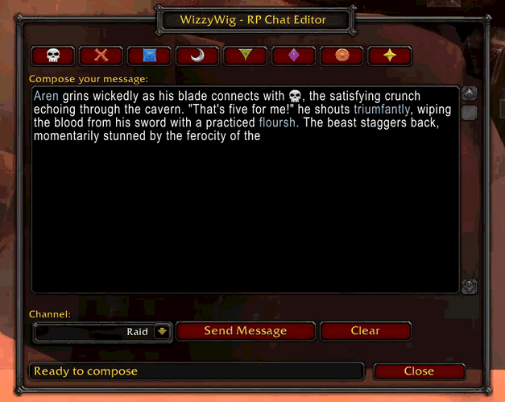

# WizzyWig - WYSIWYG Chat Editor for Roleplayers

**WizzyWig** is a What-You-See-Is-What-You-Get chat editor designed specifically for World of Warcraft roleplayers. Compose and preview your full emote or message before sending - see exactly what others will see!

## 🎬 See It In Action

  

  <em>Compose emotes with raid markers, catch typos with spell checking, and see exactly what you're sending before it goes live!</em>

## ✨ Features

### 🎯 **Visual Raid Marker Toolbar**
- Click icons to insert raid markers ({rt1}, {rt2}, etc.)
- Preview exactly how they'll look in chat
- No more memorizing marker codes!

### 📝 **Multi-Line Composition**
- 15-line editing area for longer emotes
- Compose complex narratives without sending prematurely
- Edit and refine before hitting send

### ⚠️ **Character Limit Warning**
- Visual warning at 255 characters (WoW's chat limit)
- Integrates with **EmoteSplitter** for unlimited length
- No more disconnects from oversized messages!

### 🔤 **Spell Checker Integration** (NEW!)
- Automatic integration with **Misspelled** addon
- Real-time spell checking while composing
- Requires EmoteSplitter to avoid character limit conflicts

### 💾 **Draft Preservation**
- Your text persists when closing the window
- Never lose your work from accidental closes
- Option to auto-clear after sending (disabled by default)

### 🎨 **Multiple Channels**
- Say, Emote, Party, Raid, and Raid Warning
- Quick channel switching dropdown
- Remembers your last-used channel
- Raid Warning requires raid leader or assistant role

## 📦 Installation

### CurseForge (Recommended)
1. Install via CurseForge app
2. Search for "WizzyWig"
3. Click Install

### Manual Installation
1. Download from [CurseForge](https://www.curseforge.com/wow/addons/wizzywig)
2. Extract to `World of Warcraft\_retail_\Interface\AddOns\`
3. Restart WoW

## 🎮 Usage

### Commands
- `/ww` or `/wizzywing` - Toggle main window
- Minimap icon - Click to toggle window

### Quick Start
1. Click the minimap icon or type `/ww`
2. Compose your message in the large text area
3. Add raid markers using the toolbar
4. Select your channel (Say, Emote, etc.)
5. Click **Send** when ready!

## 🔧 Configuration

Access settings via:
- `/ww config`
- Interface → AddOns → WizzyWig

**Options:**
- Clear on Send: Automatically clear text after sending (default: off)
- Frame Position: Drag to reposition (saved automatically)
- Minimap Icon: Hide/show the minimap button

## 🤝 Recommended Addons

- **[EmoteSplitter](https://www.curseforge.com/wow/addons/emotesplitter)** - Removes 255 character limit for emotes (highly recommended!)
- **[Misspelled](https://www.curseforge.com/wow/addons/misspelled)** - Spell checker integration (requires EmoteSplitter)
- **Total RP 3** - Enhanced roleplay profiles
- **MyRolePlay** - Character description addon

## 🐛 Known Issues

- Spell checker integration only works when EmoteSplitter is loaded (by design, to avoid character limit conflicts)
- Text persists between sessions (feature, not bug!) but can be changed in settings

## 📝 Changelog

See [CHANGELOG.md](CHANGELOG.md) for version history.

## 🙏 Support & Feedback

- **Issues**: [GitHub Issues](https://github.com/lawhorkl/WizzyWig/issues)
- **Suggestions**: Open a GitHub issue with [Feature Request] tag
- **CurseForge**: Leave a comment on the addon page

## 📜 License

This addon is released under the MIT License. Feel free to modify and redistribute!

## 🛠️ Development

Claude AI **is used** in development but this addon is **primarily written by a human developer**. Claude AI assists with:
- API reference lookups and WoW UI documentation
- Bug investigation and debugging
- Code review and architectural discussions (rubber duck debugging)
- Documentation clarification

The core logic, design decisions, and implementation are human-authored.

## 💖 Credits

Created by **Kyle Lawhorn**

Built with:
- Ace3 framework
- LibDBIcon for minimap integration
- Love for the WoW RP community

---

**Enjoy composing your emotes with confidence! Happy roleplaying! 🎭**
